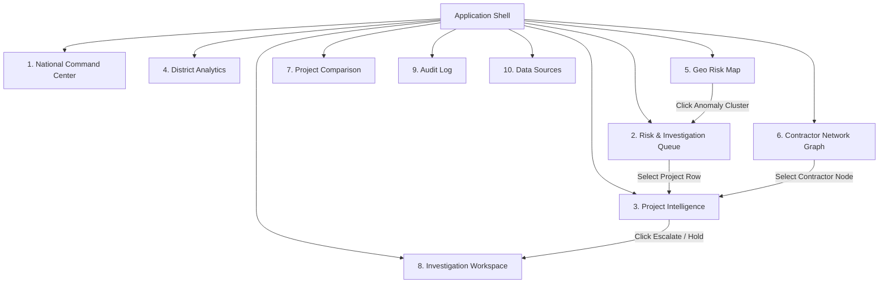

# MPLAD Intelligence — Complete UI/UX Design Specification

---

## 1. Product Overview

**MPLAD Intelligence** is a specialized, institutional-grade monitoring, analytics, and investigation prioritization platform developed specifically for the implementation of the Member of Parliament Local Area Development Scheme (MPLADS). 

The platform continuously processes multi-source scheme data—including MP recommendations, administrative sanctions, Single Nodal Account (SNA) financial releases, milestone completion reports, geo-tagged physical evidence, and implementing agency records—to highlight unusual patterns, cost inflation, progress discrepancies, and entity linkages.

### Core Philosophy & Operational Framing
* **Signal Generation, Not Automated Verdicts**: The system does NOT automatically label projects or contractors as "fraudulent." Instead, AI/ML models and deterministic compliance rule engines compute a dynamic **Risk Priority Score (0–100)** and generate explicit, evidence-backed anomaly signals.
* **Human-in-the-Loop Decision Support**: Authorized government officers review aggregated evidence, examine forensic chronologies, analyze contractor network graphs, and determine appropriate administrative actions (e.g., requesting field inspections, withholding payments, or escalating cases to formal audit).
* **Complete Auditability**: Every action, note, escalation, or status update executed within the system is immutably logged for legal and administrative accountability.

---

## 2. User Personas

| Persona | Role & Organization | Primary Goals | Key Pain Points | Platform Needs |
| :--- | :--- | :--- | :--- | :--- |
| **National Nodal Officer** | Central Officer, Ministry of Statistics & Programme Implementation (MoSPI) | Monitor scheme implementation nation-wide; ensure fund utilization aligns with policy; detect systemic anomalies. | Overwhelmed by thousands of manual monthly progress reports; inability to detect cross-state contractor syndicates. | High-density National Command Center; macro KPI metrics; state-level risk heatmaps; cross-district query filters. |
| **State Nodal Authority** | Secretary / Joint Secretary, State Planning Department | Oversight of all parliamentary constituencies within the State; audit DA allocations and SC/ST allocation compliance. | Lacks real-time visibility into district-level bottlenecks; delayed physical verification reports from remote blocks. | State/District Analytics; filterable Risk & Investigation Queue; anomaly cluster mapping. |
| **District Authority (DA)** | District Collector / District Magistrate (DM) / Deputy Commissioner | Review MP recommendations; issue Administrative Sanctions (AS); assign Implementing Agencies (IAs); verify physical work completion. | Difficulty verifying physical progress vs disbursement requests; potential political pressure; contractor concentration risks. | Deep Project Intelligence view; evidence comparison widgets (Geo-photo vs Fund release); instant field inspection dispatch workspace. |
| **Field Audit / Investigation Officer** | CAG Auditor / Vigilance Officer / Third-Party Inspector | Conduct deep-dive investigations into flagged projects; collect on-ground evidence; substantiate audit findings. | Disconnected evidence sources; fragmented paper trails; lack of historical contractor performance data. | Forensic Chronology timeline; Contractor Network Graph; evidence aggregation drawer; immutable audit notes panel. |

---

## 3. UX Goals

1. **Information Density without Cognitive Overload**: Present multi-variable risk metrics, financial data, and geospatial indicators in clean, structured cards and high-density data tables without cluttering the screen.
2. **Instant Signal Traceability**: Ensure an officer can trace any high-level risk score down to its precise underlying data discrepancy (e.g., *85% funds released vs 15% physical progress verified*) within two clicks.
3. **Calm, Authoritative Analytical Focus**: Use a restrained, dark institutional interface optimized for long monitoring sessions (8+ hours/day) that minimizes eye fatigue and visual noise.
4. **Defensible Action Workflows**: Require explicit confirmation, administrative justification, and audit-logging for high-impact operator decisions (such as holding payments or escalating to vigilance).

---

## 4. Design Principles

1. **Evidence Before Decoration**: Visual elements exist solely to present facts, signals, and relationship structures. Decorative animations, flashy gradients, and non-functional visual flourishes are prohibited.
2. **Risk Before Aesthetics**: Highlight critical risk items using distinct semantic color indicators (`#DC2626` Red) so that officers immediately notice urgent anomalies upon opening any screen.
3. **Human Decision-Making Remains Central**: The UI frames AI output explicitly as `AI/ML Signal` or `Observed Anomaly`, reserving verbs like `Confirmed` or `Sanctioned` strictly for verified officer actions.
4. **Every Number Requires Context**: Never show an isolated metric. Always provide baseline comparisons (e.g., *₹42.5L released vs ₹50L sanctioned*, *+12.3% vs last quarter*, *Peer benchmark: 45 days*).
5. **Traceable Audit Trails**: Every state change, inspection dispatch, payment hold, or investigation note must generate a visible, timestamped audit log item.

---

## 5. Visual Design System

The visual design language strictly enforces a dark institutional dashboard style suitable for national oversight command centers and specialized investigation workstations.

```
+-----------------------------------------------------------------------------------+
| #0D1117 (App Background)                                                         |
|   +-----------------------------------------------------------------------------+ |
|   | #161B22 (Surface / Card Background)                                         | |
|   | Border: 1px solid #21262D                                                   | |
|   |                                                                             | |
|   | Text: #E6EDF3 (Primary) | #7D8590 (Muted)                                   | |
|   | Accents: #0E857C (Teal Primary) | #DC2626 (Critical) | #EAB308 (Warning)      | |
|   +-----------------------------------------------------------------------------+ |
+-----------------------------------------------------------------------------------+
```

### Visual Characteristics
* **Surfaces**: Layered dark charcoal tiles (`#161B22`) over deep onyx background (`#0D1117`) with subtle 1px border lines (`#21262D`).
* **Corner Radius**: Restrained geometry with standard `4px` or `6px` radius for containers, badges, and controls.
* **Typography**: Crisp, clean monospaced font hierarchy for data tables and numeric codes, paired with an authoritative sans-serif typeface for UI headers.
* **Elevation & Shadows**: Minimal shadow usage; visual hierarchy is established strictly via surface contrast (`#161B22` vs `#21262D`) and font weights.

---

## 6. Color Tokens

Color usage is strictly semantic and functional. Colors must never be used purely as visual decoration.

| Token Name | Hex Code | Semantic Role / Application |
| :--- | :--- | :--- |
| `color-bg-base` | `#0D1117` | Main canvas background across all application screens. |
| `color-surface-card` | `#161B22` | Cards, container tiles, drawer backgrounds, modal bodies. |
| `color-surface-hover` | `#1F242C` | Table row hover, button hover, sidebar item hover. |
| `color-border-subtle` | `#21262D` | Container outlines, table dividers, card boundaries. |
| `color-border-strong` | `#30363D` | Active control borders, focused inputs, active tab indicators. |
| `color-accent-teal` | `#0E857C` | Primary interactive elements, active navigation state, primary buttons, system branding. |
| `color-accent-blue` | `#486581` | Secondary actions, neutral metadata highlights, data visualization elements. |
| `color-text-primary` | `#E6EDF3` | Headings, primary table values, metric digits, main body text. |
| `color-text-muted` | `#7D8590` | Labels, subtitles, timestamp strings, table headers, breadcrumbs. |
| `color-status-critical` | `#DC2626` | Critical priority badges, high-risk scores (80–100), critical anomaly alerts, payment hold status. |
| `color-status-warning` | `#EAB308` | Review required badges, medium-risk scores (50–79), physical/financial timeline warnings. |
| `color-status-success` | `#238636` | Low risk scores (0–49), verified status, normal progress, cleared audit state. |

---

## 7. Typography

The platform utilizes system font stacks optimized for data density and screen legibility: `Inter`, `-apple-system`, `BlinkMacSystemFont`, `Segoe UI`, `Roboto`, `sans-serif`. All numeric IDs, monetary values, timestamps, and coordinates use tabular monospaced numbers (`JetBrains Mono` or `ui-monospace`).

| Type Scale | Size | Line Height | Weight | Case / Style | Usage |
| :--- | :--- | :--- | :--- | :--- | :--- |
| `Display Title` | 24px | 32px | 700 (Bold) | Normal | Page titles (e.g., *National Command Center*, *Project Intelligence*) |
| `Section Title` | 18px | 24px | 600 (SemiBold) | Normal | Card headers, modal titles, drawer section headers |
| `Metric Value` | 28px | 34px | 700 (Bold) | Tabular Monospace | KPI numerical figures (e.g., *42,891*, *₹8,450 Cr*, *92/100*) |
| `Body Primary` | 14px | 20px | 400 (Regular) | Normal | Primary table cell content, evidence descriptions, officer notes |
| `Body Medium` | 14px | 20px | 500 (Medium) | Normal | Button text, form labels, active tab text |
| `Caption / Muted` | 12px | 16px | 400 (Regular) | Normal | Field subtitles, metric trend indicators, metadata |
| `Table Header` | 11px | 16px | 600 (SemiBold) | UPPERCASE | Data table column headers, status badge labels |

---

## 8. Spacing & Grid

* **Base Unit**: 4px grid system (`4px`, `8px`, `12px`, `16px`, `24px`, `32px`, `48px`).
* **Page Padding**: `24px` horizontal and vertical padding around primary dashboard containers.
* **Card Internal Padding**: `16px` or `20px` uniform padding.
* **Component Gap**: `12px` or `16px` between layout cards; `8px` between inline form controls.
* **Table Cell Density**: `10px` vertical padding, `12px` horizontal padding for high data density.

---

## 9. Application Shell

The desktop application shell provides a persistent frame enclosing the entire operational platform.

```
+-------------------------------------------------------------------------------------------------+
| TOP BAR: Logo | Search Projects, IDs... | Reporting Period [Q3 FY23-24] | Alerts (3) | Officer  |
+-------------------+-----------------------------------------------------------------------------+
| SIDEBAR           | MAIN CONTENT AREA                                                           |
| - Overview        |                                                                             |
| - Risk & Queue    |                                                                             |
| - Project Intel   |                                                                             |
| - District Analytics|                                                                            |
| - Geo Risk Map    |                                                                             |
| - Contractor Net  |                                                                             |
| - Comparison      |                                                                             |
| - Workspace       |                                                                             |
| - Audit Log       |                                                                             |
| - Data Sources    |                                                                             |
| - Settings        |                                                                             |
+-------------------+                                                                             |
| FOOTER PROFILE    |                                                                             |
| Officer Name / DA |                                                                             |
+-------------------+-----------------------------------------------------------------------------+
```

### Specifications
* **Left Sidebar Width**: Fixed `240px`. Dark background (`#0D1117`), right border (`1px solid #21262D`).
* **Top Bar Height**: Fixed `56px`. Surface background (`#161B22`), bottom border (`1px solid #21262D`).
* **Main Content Area**: Fluid width, responsive scroll container with background (`#0D1117`).

---

## 10. Navigation Architecture



---

## 11. National Command Center

```
+-------------------------------------------------------------------------------------------------+
| National Command Center                                       [ Export Report ] [ + New Case ]  |
| Real-time monitoring of Member of Parliament Local Area Development Scheme                      |
+------------------+-------------------+--------------------+-------------------------------------+
| MONITORED        | HIGH-RISK         | DETECTED ANOMALIES | SANCTIONED VALUE                    |
| 42,891           | 1,204             | 347                | ₹8,450 Cr                           |
| +2.4% vs last qtr| +12.3% Immediate  | +5.2% vs last week | Current FY Allocation               |
+------------------+-------------------+--------------------+-------------------------------------+
| ANOMALY TREND (BAR CHART)                    | GEOGRAPHIC RISK MAP                              |
| [ Critical | High | Medium | Low | Normal ]    | Heatmap overlay of India districts               |
| [Mon] [Tue] [Wed] [Thu] [Fri] [Sat] [Sun]    | Critical Zone: Uttar Pradesh - Region 4          |
+----------------------------------------------+--------------------------------------------------+
| PRIORITY REVIEW QUEUE                                                                           |
| Project ID | Project Name | Agency | Risk Score | Primary Signal | Status | Action             |
| KPL-UP-0921| Community Health...| PWD III| 94/100 | Vendor Network Overlap | Under Inv | Review  |
| KPL-MH-4432| Rural Road Imp...  | ZP Pune| 72/100 | Timeline Dev (+6mo)    | Pending   | Review  |
+-------------------------------------------------------------------------------------------------+
```

### Component Details
* **KPI Strip**: 4 columns. Cards show single metric value (`28px Tabular`), label (`12px Muted`), and status indicator badge.
* **Anomaly Trend**: Interactive stacked bar chart displaying daily anomaly detections categorized by severity.
* **Geographic Risk**: Mini geospatial vector view showing high-risk clusters across states and districts.
* **Priority Queue Table**: 6-column high-density preview table showing top flagged projects.

---

## 12. Risk & Investigation Queue

### Layout & Filters
High-density operational data table with top filter toolbar:
* **Filters**: State dropdown, District dropdown, Scheme Category (Health, Roads, Education, Water), Risk Score Range (Slider), Anomaly Signal Type, Reporting Period.
* **Search Input**: Full-text search matching Project ID, MP Name, Contractor Name, or Location Keyword.

### Table Schema

| Column Header | Width | Alignment | Data Type & Formatting |
| :--- | :--- | :--- | :--- |
| `PROJECT ID` | 120px | Left | Monospace ID string (e.g., `MPL-MH-2023-441`) |
| `PROJECT NAME & DETAILS` | 260px | Left | Title (`14px Bold`), Subtitle with District & State (`12px Muted`) |
| `IMPLEMENTING AGENCY` | 160px | Left | Text string (e.g., `PWD Division 4 Pune`) |
| `RISK PRIORITY SCORE` | 130px | Center | Score badge: Red pill for >80, Yellow for 50-79, Green for <50 |
| `PRIMARY SIGNAL` | 220px | Left | Signal icon + concise text label (e.g., `Financial/Physical Mismatch`) |
| `STATUS` | 130px | Center | Status badge (`Not Reviewed`, `Under Review`, `Payment Held`, `Closed`) |
| `ACTION` | 90px | Right | Context menu icon button `[...]` / `View Intelligence` link |

---

## 13. Project Intelligence

The central screen for deep-dive investigation of an individual MPLADS project.

```
+-------------------------------------------------------------------------------------------------+
| [CRITICAL PRIORITY] ID: MPL-MH-2023-441                                  RISK PRIORITY SCORE    |
| Construction of Multipurpose Community Hall                              92 / 100               |
| District: Pune, Maharashtra | Agency: PWD Division 4 | Sanctioned: 14-Aug-2022                      |
+-------------------------------------------------------------------------------------------------+
| EVIDENCE & TRIGGER SIGNALS                                           [ Export Evidence Report ] |
| +---------------------------------------------------------------------------------------------+ |
| | FINANCIAL/PHYSICAL DISCREPANCY                                                TGR-001 | 2 Days  | |
| | 85% of total project funds (₹42.5L) released in 3 tranches, while physical progress        | |
| | reported via Geo-tagging is strictly validated at 15% (Foundation phase incomplete).         | |
| | Funds Released: 85%  [===================  ]  Physical Progress: 15% [====             ]  | |
| +---------------------------------------------------------------------------------------------+ |
| | CONTRACTOR RISK NETWORK                                                       TGR-042 | 5 Days  | |
| | Primary contractor entity ('Shree Buildcon') shares 2 direct directors with blacklisted     | |
| | firm ('Apex Infra') currently under investigation in neighboring district projects.        | |
| +---------------------------------------------------------------------------------------------+ |
| RISK BREAKDOWN MATRIX                  | FORENSIC CHRONOLOGY                                    |
| - Financial Velocity: High (89)        | - Today 09:42: Auto-Alert Triggered                    |
| - Physical Progress: Critical (90)     | - 12-Oct-23: Tranche 3 Released (₹15L)                 |
| - Timeline Variance: Warning (75)      | - 18-Aug-23: Physical Inspection Photo Uploaded        |
| - Contractor Integrity: High (88)      | - 14-Aug-22: Administrative Sanction Issued            |
+----------------------------------------+--------------------------------------------------------+
```

---

## 14. Evidence & Trigger Signals

Evidence cards present clear factual observations alongside system anomaly alerts.

```
+-------------------------------------------------------------------------------------------------+
| EVIDENCE CARD: Financial Release vs Physical Progress Mismatch                                  |
+-------------------------------------------------------------------------------------------------+
| OBSERVED FACT:                                                                                  |
| - Total Sanctioned Cost: ₹50,00,000 (Fifty Lakhs INR)                                           |
| - Total Funds Disbursed to Date: ₹42,50,000 (85.0%) across 3 installmental releases.           |
| - Verified On-Ground Physical Progress: 15.0% (Stage: Foundation Complete).                    |
|                                                                                                 |
| AI/ML ANOMALY SIGNAL:                                                                           |
| - Severity: CRITICAL (Confidence Score: 0.94)                                                   |
| - Anomaly Classification: Rapid Disbursement without Milestone Attainment.                     |
| - Peer Benchmark Deviation: Progress rate is 4.2x slower than average Pune district PWD works.  |
|                                                                                                 |
| OFFICER DECISION STATUS:                                                                        |
| [ Current Status: Under Officer Review | Assigned to: DA Inspection Wing Pune ]                  |
+-------------------------------------------------------------------------------------------------+
```

---

## 15. Forensic Chronology

A vertical timeline representing every administrative, financial, physical, and system event in chronological order.

* **Timeline Item Anatomy**:
  * Left: Tabular Date & Time (`12 Oct 2023, 14:32 IST`).
  * Center: Node icon colored by severity (Red for alert, Blue for financial release, Green for sanction).
  * Right: Event Title, Event Actor/System Name, Data payload (e.g., `Tranche 3 Amount: ₹15.00L`), and link to raw documentation.

---

## 16. Operator Workspace

A dedicated right-side action panel on the Project Intelligence screen providing controlled administrative mechanisms.

```
+--------------------------------------------------+
| WORKSPACE ACTION PANEL                           |
+--------------------------------------------------+
| PRIMARY ACTIONS:                                 |
| [ Request Field Inspection ]                     |
| [ Hold Payment Release    ] (Triggers Modal)     |
| [ Escalate to Vigilance   ] (Triggers Modal)     |
| [ Mark Verified / Clear   ] (Requires Justification)|
|                                                  |
| INVESTIGATOR NOTES:                              |
| +----------------------------------------------+ |
| | Enter forensic observation notes here...     | |
| +----------------------------------------------+ |
| [ Save Note ]                                    |
+--------------------------------------------------+
```

---

## 17. Investigation Workspace

Full-screen comprehensive case view consolidating all 8 investigation dimensions into a unified workspace layout:

1. Project Master Meta Data
2. Dynamic Risk Priority Score Breakdown
3. Aggregated Evidence & Mismatch Cards
4. Financial Disbursement Breakdown (SNA / Treasury log)
5. Physical Geo-Tag Verification Gallery
6. Contractor & Implementing Agency Relationship Graph
7. Forensic Event Chronology
8. Audit Trail & Officer Actions Drawer

---

## 18. District Analytics

Provides comparative analytics across districts and constituencies:
* **Metric Comparison**: Expenditure velocity, completion rate %, anomaly density per 100 works.
* **Scatter Plot**: X-axis = Total Funds Released (₹), Y-axis = Physical Progress (%), Dots colored by Risk Level.
* **Peer Group Benchmarking**: Automated clustering comparing Pune District with similar Tier-2 mixed rural/urban districts in Maharashtra.

---

## 19. Geo Risk Map

Geospatial intelligence module displaying risk distribution:
* **Base Map**: Dark themed vector map of India with state and district boundaries (`#161B22` landmass, `#21262D` boundaries).
* **Heatmap Layer**: Red glow intensity mapped to anomaly density.
* **Interactive Markers**: Clickable project pins (Red = High Risk, Yellow = Warning, Green = Verified).
* **Sidebar Drilldown**: Filter map by scheme sector (e.g., *Drinking Water*, *Education*) or risk score range.

---

## 20. Contractor Network Graph

Interactive node-link graph visualizer detailing vendor and agency connections:
* **Nodes**: 
  * `Square Node` = Implementing Agency (e.g., *PWD Division 4*).
  * `Circle Node` = Contractor / Vendor Entity (e.g., *Shree Buildcon*).
  * `User Icon Node` = Key Directors / Promoters.
* **Edges / Links**: Lines indicating contracts awarded, directorship overlaps, shared registered addresses, or common bank accounts.
* **Investigation Value**: Instantly highlights contractor cartels, bid-rigging rings, and high vendor concentration anomalies.

---

## 21. Project Comparison

Side-by-side comparative inspection tool for up to 4 selected projects:
* **Rows**: Sanctioned Cost, Total Disbursed, Disbursement Velocity (Days per tranche), Verified Physical Progress %, Geo-photo Count, Anomaly Score, Contractor Name.
* **Visual Diffing**: Cell backgrounds automatically highlight severe deviations between projects of similar nature in the same district.

---

## 22. Audit Log

A high-density immutable system log screen tracking every user interaction:
* **Columns**: `TIMESTAMP`, `OFFICER NAME`, `ROLE / AGENCY`, `ACTION TYPE`, `TARGET PROJECT ID`, `JUSTIFICATION / REASON`, `IP ADDRESS`.
* **Security Feature**: Read-only interface with cryptographic hash verification indicator for every log entry.

---

## 23. Data Sources

System health and data pipeline transparency screen showing data origin, synchronization status, and freshness metrics:
* **Sources Tracked**: eSAKSHI Portal Sync, PFMS / SNA Treasury Feed, Bhuvan / ISRO Geo-Tag Feed, MCA Company Registry Feed, State PWD e-Procurement Feed.
* **Status Badges**: `SYNCED` (Green), `DELAYED` (Yellow), `ERROR / DISCONNECTED` (Red).

---

## 24. Component Library

### UI Component Anatomy

```
+------------------------------------------------------------------------------------+
| COMPONENT: Severity Badge                                                          |
| Anatomy: [Icon] + [Label Text]                                                     |
| Critical State: Background #2D1214 | Border #7A1D21 | Text #F87171 | Icon #EF4444  |
| Warning State:  Background #2E2511 | Border #7C5E10 | Text #FACC15 | Icon #EAB308  |
| Normal State:   Background #122B1E | Border #1B5E38 | Text #4ADE80 | Icon #22C55E  |
+------------------------------------------------------------------------------------+
```

1. **KPI Cards**: Surface container (`#161B22`), top colored accent bar (3px), bold metric display, delta indicator badge.
2. **Filter Bar**: Flex container with custom dark select dropdowns, clear all button, active filter count tag.
3. **Data Tables**: Striped dark rows (`#161B22` / `#11161D`), sticky header with uppercase column titles, inline status badges.
4. **Action Confirmation Modals**: Overlay backdrop (`rgba(0,0,0,0.75)`), modal box (`#161B22`), mandatory reason text field, dual confirmation buttons (*Confirm Action* / *Cancel*).

---

## 25. Interaction States

All interactive controls must implement 5 distinct visual states:

```
[ Default ] ---> Hover (#1F242C) ---> Focus (Teal Ring) ---> Active (#0E857C) ---> Disabled (50% Opacity)
```

* **Irreversible Action Guardrails**: Critical actions (*Hold Payment*, *Escalate to Vigilance*) require a 2-step confirmation dialog with a mandatory text input field requiring the officer to type a justification (minimum 15 characters).

---

## 26. Accessibility

* **Color Contrast**: All text elements adhere to WCAG 2.1 AA standards (minimum 4.5:1 contrast ratio against dark background `#161B22`).
* **Non-Color Indicators**: Every status or risk indicator pair color with a unique icon or text string (e.g., Red + `[!] CRITICAL`, Yellow + `[?] REVIEW`).
* **Keyboard Navigation**: Full `Tab` key navigation support across data tables, filter controls, modal dialogs, and workspace action panels.

---

## 27. Responsive Behavior

Optimized primarily for enterprise desktop displays (`1440px` and `1920px` monitoring command displays).

| Screen Width | Shell Layout Behavior |
| :--- | :--- |
| **> 1600px** | Expanded persistent sidebar (`240px`), 4-column KPI strip, side-by-side Project Intelligence & Workspace panel. |
| **1280px – 1599px** | Compact sidebar (`200px`), 4-column KPI strip, stacked evidence and chronology panels. |
| **< 1280px** | Collapsible navigation drawer, data tables switch to horizontal scroll mode, workspace action panel slides in as a right-side drawer. |

---

## 28. Data & Content Model

```json
{
  "project_id": "MPL-MH-2023-441",
  "project_name": "Construction of Multipurpose Community Hall",
  "state": "Maharashtra",
  "district": "Pune",
  "sanctioned_amount_inr": 5000000.0,
  "released_amount_inr": 4250000.0,
  "financial_progress_pct": 85.0,
  "verified_physical_progress_pct": 15.0,
  "risk_priority_score": 92,
  "primary_anomaly_category": "Financial/Physical Progress Mismatch",
  "implementing_agency": "PWD Division 4 Pune",
  "primary_contractor": "Shree Buildcon Ltd",
  "status": "UNDER_OFFICER_REVIEW"
}
```

---

## 29. Implementation Guidelines

* **CSS / Styling**: Tailwind CSS configured with custom color theme extensions matching design system tokens (`bg-base: #0D1117`, `bg-card: #161B22`, `border-subtle: #21262D`, `accent-teal: #0E857C`).
* **State Management**: React Context or Redux Toolkit for managing active filters, selected project cases, and operator workspace drawer states.
* **Chart Componentry**: Recharts or Chart.js styled with dark background gridlines (`#21262D`) and semantic stroke colors.
* **Graph Engine**: `Vis.js` or `Cytoscape.js` integrated inside a React canvas container for the Contractor Network Graph.

---

## 30. Acceptance Checklist

- [x] Application shell implements persistent left sidebar and top bar with strict dark institutional colors (`#0D1117`, `#161B22`, `#21262D`).
- [x] All 10 color tokens match the specified visual system (`#0E857C` Teal, `#DC2626` Red, `#EAB308` Yellow, `#238636` Green).
- [x] Terminology strictly avoids automated fraud declarations, using "Risk Score", "Anomaly Signal", and "Requires Review".
- [x] Primary Screen 1 (National Command Center) contains KPI strip, anomaly trend chart, geo risk panel, and priority review queue.
- [x] Primary Screen 2 (Risk & Investigation Queue) features full filtering, search, sorting, and tabular data density.
- [x] Primary Screen 3 (Project Intelligence) displays Risk Breakdown Matrix, Evidence Cards, Forensic Chronology, and Workspace Action Panel.
- [x] Supporting modules (District Analytics, Geo Risk Map, Contractor Network, Project Comparison, Audit Log, Data Sources) fully specified.
- [x] Accessibility rules enforce non-color semantic indicators and WCAG AA contrast standards.
